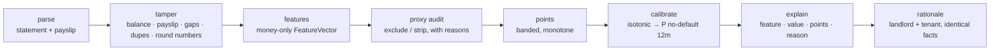

# affordability-scorer — explainable, POPIA-aware tenant affordability scoring for SA rentals

[](https://github.com/darrshangovender/affordability-scorer/actions/workflows/tests.yml)
[](LICENSE)
[](pyproject.toml)
[](#a-note-on-fairness-and-law)

> Parse a South African bank statement and payslip, check the documents have not been edited, derive money-only features, and turn them into a 0–100 score where every point is explained — to the landlord *and* the tenant, in the same words. No credit bureau, no protected attributes, no LLM in the scoring path.

## Why this exists

A rental agent in Durban gets a PDF statement, a payslip and a WhatsApp saying "can they afford R7 800?". Today that question is answered by a rule of thumb (rent under a third of income), a gut feel about the applicant, or a credit-bureau report that says nothing about whether this person can carry *this* rent. The gut feel is where discrimination lives, and the bureau report is where POPIA problems live.

This package is the Tenant Score pattern behind [LeasEase](https://leasease.co.za), released as a standalone library: deterministic, offline, testable, and built so that the fairness and privacy guarantees are structural rather than policy.

## A note on fairness and law

- **No protected attributes, by construction.** `FeatureVector` is a frozen pydantic model with `extra="forbid"`; `fairness.assert_no_protected_fields` checks its schema at import time against the grounds in the Employment Equity Act s.6 / PEPUDA / Constitution s.9. `FeatureVector(race=...)` is a validation error, not a policy.
- **Proxy audit.** Transactions whose descriptions reveal a protected ground are excluded from every feature before scoring and the report says why: tithes and mosque payments (religion), maintenance and crèche fees (family status), medical aid and clinics (health), Home Affairs and remittance corridors (nationality). Suburb names are stripped from descriptions (location proxies for race) but the amount is kept. Salary credits are never excluded because of the employer's name — a nurse's income is not health data.
- **Not a credit bureau.** Nothing here is a credit report under the National Credit Act; there is no bureau data, no default history, and the output is an affordability opinion on documents the applicant supplied.
- **POPIA lawful purpose.** Every scoring call carries a `ScoringPurpose` (purpose from a closed list, consent reference, requester, lawful basis). An `AccessLog` records who scored whom (pseudonymised) and `purge(older_than_days)` enforces retention. SA ID numbers (Luhn-checked), account numbers, phone numbers and emails are redacted from every log line and from any model prompt.
- **No LLM needed to score.** The score, the explanation and both rationales are deterministic Python. An optional `ModelClient` may reword the rationale; `polish()` asserts every number and every reason survived, and raises otherwise.

## Quick start

```bash
pip install -e ".[dev]"
python demo/generate.py                      # 12 synthetic personas + 2 tampered variants (seeded)
affordability score --statement demo/data/p07_teacher/statement.csv \
                    --payslip   demo/data/p07_teacher/payslip.txt --rent 7800
affordability score ... --json               # full assessment: features, points, audit, tamper, rationales
affordability audit  --statement demo/data/p06_nurse/statement.txt      # what the proxy audit excluded and why
affordability tamper --statement demo/data/t01_edited_salary/statement.csv --payslip demo/data/t01_edited_salary/payslip.txt
python eval/run.py                           # the table under "The result", offline
```

```python
from affordability import ScoringPurpose, score_application

purpose = ScoringPurpose(purpose="tenant_affordability_assessment", consent_ref="APP-2041", requested_by="agent-17")
a = score_application(statement="statement.csv", payslip="payslip.txt", rent=7800, purpose=purpose)
a.score.score, a.score.band, a.tamper.risk        # (74, 'adequate', 'low')
print(a.rationale.tenant)                         # same reasons the landlord sees
```

## How it works



Four statement layouts are recognised without naming the bank (FNB-style signed CSV, Standard Bank-style debit/credit CSV, Capitec-style pipe text with `R` and comma decimals, Absa-style space-thousands CSV), dates are `dd/mm/yyyy`, and each line is keyword-classified into ten categories. The proxy audit runs before feature sums so excluded lines never touch a feature; balance features use the full ledger because the balance is a fact about the account, not about any one payment.

## The scoring model

Score = 50 + Σ points, clipped to 0–100. Bands: **strong** 75–100 · **adequate** 60–74 · **marginal** 45–59 · **insufficient** 0–44. Upper bounds are inclusive; `explain()` returns exactly these rows, ordered by absolute impact, and they sum to the score.

| feature | bands → points | why |
|---|---|---|
| rent_to_income | ≤30% +20 · ≤40% +5 · ≤50% −15 · >50% −30 | the question being asked; dominates by design |
| commitment_ratio | ≤15% +10 · ≤30% +3 · ≤45% −8 · >45% −15 | debit orders + loans are the money that leaves before rent can |
| residual_ratio | <−5% −25 · <5% −15 · <20% 0 · ≥20% +10 | income − fixed − typical spend − proposed rent, as a share of income |
| income_cv | ≤5% +8 · ≤15% +4 · ≤30% 0 · >30% −10 | commission and piece-work swing; a swing is a risk, not a disqualifier |
| salary_regularity | ≤1 day +5 · ≤3 +2 · ≤7 0 · >7 −5 | std-dev of pay day; a drifting pay day is a drifting employer |
| min_balance | ≤−R2 000 −15 · <R0 −5 · <R5 000 +3 · ≥R5 000 +6 | lowest closing balance in the period |
| overdraft_days | 0 +5 · ≤5 0 · ≤20 −8 · >20 −15 | calendar days spent negative |
| gambling_share | ≤1% +3 · ≤5% 0 · ≤15% −10 · >15% −20 | share of all debits going to betting operators |
| months_observed | <6 0 · ≥6 +3 | more history, a little more confidence |

Calibration re-labels the score axis as P(no missed payment in 12 months) with isotonic regression fitted on a **synthetic** labelled set; it is illustrative until refit on real outcomes.

## The result

`python eval/run.py`, offline, on the seeded demo set (12 clean personas from domestic worker to doctor, 2 tampered variants):

| check | result |
|---|---|
| Transaction classifier vs generator labels (2 126 lines, 10 categories) | 100.0% accuracy; precision and recall 100% in every category |
| Score band vs labelled 12-month outcome (n = 12, pass = strong or adequate) | 91.7% (11/12): 6 true pass, 5 true fail, 1 false fail, 0 false pass |
| Calibration Brier score | 0.124 on the 12 personas; 0.216 on a 2 000-vector synthetic hold-out (base-rate baseline 0.250) |
| Tamper detection (risk = high on 2 tampered + 12 clean) | precision 100%, recall 100% — edited salary caught by running balance + payslip; duplicated salary caught by reference |
| Disparate impact on random no-signal groups (four-fifths ratio, 50 splits) | mean 0.958 (min 0.886) over 1 200 persona variants; mean 0.963 (min 0.904) over 5 000 synthetic vectors |

The one miss is the security guard: rent at 39% of income and a Capfin loan put him at 57 (marginal) although his label says he paid every month. The disparate-impact ratios sit below 1.0 only by sampling noise on a coin-flip split; the eval fails if they drift below 0.90 / 0.95.

## Design decisions

- **Points, not a fitted model.** A band table is the whole model, so the explanation is not an approximation of the score — it *is* the score. Monotonicity (more income never lowers the score) is a property of the table and is tested.
- **Affordability features carry the weight.** Stability features (regularity, balance, gambling) can move a score by about a band; they cannot make a rent above half of income look strong.
- **Audit before sum.** The proxy audit runs on the raw ledger and hands the kept lines to the feature builder, so there is no path by which an excluded line feeds a feature.
- **Both rationales from one source.** Landlord and tenant text are rendered from the same `explain()` rows, including zero-point items, so neither party is told something the other is not.
- **Redaction at the edges.** A `logging.Filter` rewrites every record on the package loggers; the model prompt passes through `redact()`; the access log stores a hash of the subject.
- **Synthetic data is committed and reproducible.** `demo/generate.py` is seeded; a test regenerates it into a temp dir and asserts byte equality with `demo/data/`.

## Limitations

- **Synthetic calibration ≠ real defaults.** The probability column is illustrative; the isotonic map must be refit on real 12-month outcomes before anyone quotes it.
- **Keyword classifier.** Ten categories from regexes tuned to common SA descriptions. It is 100% on the generator's vocabulary and will be worse on real exports; misclassified salary or rent lines move the score.
- **No bureau data.** Existing arrears, judgments and other accounts are invisible; this is one input to a decision, not the decision.
- **Tamper checks catch naive edits only.** A statement re-chained with consistent balances and a matching forged payslip passes. Verify originals with the bank for anything that matters.
- **Twelve personas is a demonstration, not a validation.** The band-vs-outcome figure is on hand-labelled synthetic cases.

## Project layout

```
affordability/
  parse/statement.py   four SA layouts, R + comma decimals, dd/mm/yyyy, keyword categories
  parse/payslip.py     employer, pay date, gross, net, deductions from payslip text
  parse/tamper.py      running balance, payslip ±2%, date gaps, duplicate refs, round numbers → TamperReport
  features.py          FeatureVector (money only, extra="forbid") from ≥3 months of transactions
  score.py             band table → 0–100 + band; explain()
  calibrate.py         isotonic score → probability on synthetic labels; Brier
  fairness.py          protected-field guard, proxy_audit(), disparate_impact_test()
  privacy.py           ScoringPurpose, redact(), RedactingFilter, AccessLog.purge()
  rationale.py         landlord + tenant text; optional ModelClient polish with integrity check; MockModel
  pipeline.py          score_application()
  cli.py               affordability score | audit | tamper
demo/generate.py       seeded personas, four bank layouts, two tampered variants → demo/data/
eval/run.py            the table above, offline
tests/                 offline suite
```

## Tests

134 test functions (259 collected cases), all offline: every bank layout; comma decimals and every money spelling; each category rule; running balance catching an edited line in every layout; payslip mismatch and the 2% tolerance; feature maths on a hand-built ledger; every band boundary; monotonicity on the ledger and on random vectors; `explain()` summing to the total; `FeatureVector(race=...)` raising; proxy audit excluding tithes, maintenance, medical and Home Affairs and keeping hospital salaries; disparate impact ≈ 1.0 on random groups; PII never in logs or `MockModel` prompts; purge; generator determinism; CLI smoke.

```bash
pytest tests/ -q && ruff check . && python eval/run.py
```

## Author

Darrshan Govender · [LeasEase](https://leasease.co.za) · [Agulhas Code](https://agulhascode.co.za) · Durban, South Africa
